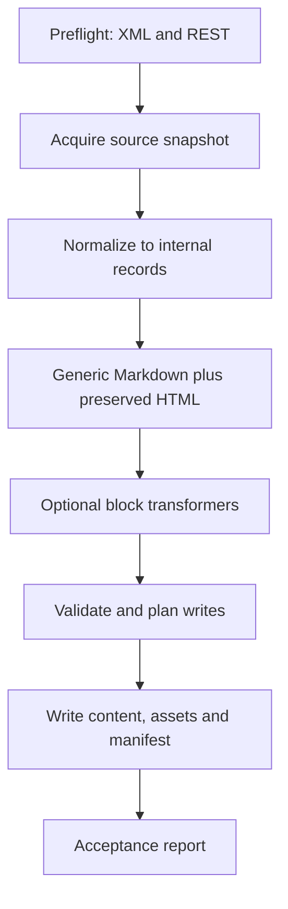

# Architecture v2.01 — generic WordPress → Eleventy one-shot migration

**Status:** accepted design baseline  
**Date:** 2026-09-14  
**Baseline implementation:** `d68ddf789cb9f61a484596e9c6cd0887de620725`  
**Companion evidence:** `wp-eleventy-migrator-audit-01-2026-09-14.md` and `jaali-eu-migration-source-audit-01-2026-09-14.md`

## 1. Purpose and boundary

The tool performs an auditable, one-time extraction from WordPress into an Eleventy project. WordPress is expected to be retired after the migration is accepted. The product must therefore prioritise completeness, source traceability, safe fallbacks, and reproducible output over an attractive but lossy conversion.

The tool does **not** replicate WordPress administration, theme behaviour, plugin runtime, or ongoing editorial synchronisation. It produces source material and migration artefacts for an Eleventy developer to review and build.

## 2. Locked decisions

| Decision | v2.01 rule |
|---|---|
| Content model | One source item becomes one Markdown document with YAML front matter. Site-wide data only belongs in `_data/*.json`. |
| HTML conversion | Two stages: generic core preserves body HTML block-by-block; opt-in transformers may emit Nunjucks shortcodes/macros/includes. |
| Authentication | REST API + Application Password is the normal authenticated path (WordPress 5.6+). Public REST is a discovery/sniff test only. |
| Backup gate | XML export is mandatory before write phase. It is recorded in the manifest; credentials are never recorded. |
| Target | Native Eleventy + Nunjucks-compatible output, with no target-site-specific coupling. |
| Safety | Fresh output directory, deterministic writes, collision detection, dry-run, and explicit diagnostics. |
| Compatibility | Existing Kadence handling is a plugin transformer, not an assumption of the generic core. |

These rules must not be bypassed by presets or the UI.

## 3. Output contract

```text
<outputRoot>/
  content/
    posts/<slug>.md
    pages/<slug>.md
    <custom-type>/<slug>.md
  assets/                         # optional, manifest-backed downloads
  _data/navigation.json           # only site-wide navigation data
  redirects.csv                   # optional but source-derived
  migration-manifest.json
  migration-report.json
  migration-config.json           # redacted, versioned effective config
```

A document has front matter for canonical target metadata and a body that preserves the source content unless a selected transformer replaces a clearly identified block. The manifest maps each source ID and URL to its target path, body treatment, asset results, warnings, and transformer versions.

## 4. Processing model



### Preflight

Validate config, target directory, XML backup reference, REST reachability, authenticated access, selected content types, and required transformer capabilities. Fail before writing for missing mandatory prerequisites. A public endpoint may establish that REST exists, but protected/private content must be acquired with authenticated REST.

### Acquire and normalize

Fetch each selected REST collection, pagination included, then normalize it into a stable internal record independent of endpoint shape. Preserve raw source fragments needed for verification. Resolve taxonomy, author, parent, featured-media, and menu relationships by ID. Do not allow the renderer to call WordPress directly.

### Render

The core renderer owns front matter, document paths, and generic body preservation. It writes Markdown with embedded source HTML when semantic Markdown conversion is not provably safe. A transformer receives an identified content block and returns either transformed Nunjucks or a structured “not handled” result; it cannot silently erase content.

### Validate, write, and report

Build a complete write plan before touching the destination. Check duplicate paths, invalid YAML, unresolved internal links, missing/downloading assets, redirects, and unhandled blocks. Write atomically where practical. Emit a manifest even for dry runs.

## 5. Module decomposition

The legacy `scripts/wp-eleventy-migrate.mjs` is roughly 5,287 lines. Replace it incrementally with these modules; the legacy command remains a thin compatibility entry point until the CLI migration is complete.

| Module | Responsibility | Must not own |
|---|---|---|
| `src/config/` | schema, defaults, presets, redaction, effective config | fetching or rendering |
| `src/preflight/` | XML gate, REST sniff/auth checks, target safety | document conversion |
| `src/source/wp-rest/` | authenticated REST client, pagination, endpoint adapters | filesystem writes |
| `src/normalize/` | stable records and relationship resolution | Nunjucks generation |
| `src/render/core/` | paths, YAML, Markdown-with-HTML body, source identity | source HTTP |
| `src/transformers/` | opt-in block/theme conversions (Kadence first) | global write orchestration |
| `src/assets/` | asset discovery, fetch, hashing, rewriting | content-type policy |
| `src/navigation/` | menu adapters and `_data/navigation.json` | page rendering |
| `src/redirects/` | source-to-target redirect plan | HTTP acquisition |
| `src/validate/` | invariants and acceptance checks | interactive prompts |
| `src/output/` | write plan, atomic output, manifest/report | WordPress semantics |
| `src/app/` | orchestrates the pipeline as an application service | CLI/UI presentation |
| `src/cli/`, `src/ui/` | collect input and present progress | migration business logic |

## 6. Transformer contract

Each transformer is selected explicitly in versioned config and declares:

- accepted WordPress block/HTML signature and required attributes;
- emitted Nunjucks syntax and any partial/macro files it creates;
- fallback behaviour: preserve original block plus a diagnostic when not handled;
- idempotence and path/asset dependencies;
- fixture-based tests for supported, unsupported, malformed, and nested cases.

The transformer registry owns ordering and compatibility. Kadence’s existing 32 recognised blocks become one registry implementation. WPBakery, Total, and Slider Revolution must be treated as independent adapters; the Jääli.eu audit is the acceptance fixture for proving that theme assumptions do not leak into generic conversion.

## 7. Migration configuration

Configuration is versioned and schema-validated. It declares source URL, authentication reference (not secret), XML backup reference, selected content types, destination root, asset and redirect policy, front-matter mapping, and transformers. Presets may fill defaults but cannot silently enable lossy conversion or bypass the XML/authentication rules.

A saved effective config must be safe to commit: redact application passwords, tokens, cookies, and local secret paths.

## 8. Verification and acceptance

A migration is acceptable only when:

1. XML backup and authenticated source preflight succeeded.
2. Every acquired source item has a unique manifest entry and either an output file or an explicit skip reason.
3. Output paths are collision-free; front matter parses; generated Nunjucks is syntactically checked where emitted.
4. Every preserved/converted block is accounted for; unsupported blocks remain visible and are reported.
5. Asset, internal-link, taxonomy, menu, and redirect results are reported rather than assumed.
6. Dry-run and real-run plans agree except for write-result fields.
7. Fixture tests cover generic WordPress content and the Jääli.eu WPBakery/Total/Slider Revolution case.

The audit documents define the three P0 and six P1 acceptance items. This architecture intentionally does not rename or reinterpret them; implementation tickets must cite their exact audit ID and acceptance criteria.

## 9. Delivery sequence

1. Land this architecture and bring `CLAUDE.md` in sync with the actual baseline.
2. Add test harness plus source fixtures and a versioned config schema.
3. Implement the P0 items one by one behind the application-service boundary, with acceptance tests.
4. Extract source, normalization, render, and output modules while retaining a compatibility command.
5. Move Kadence code into the transformer registry; add new ecosystem transformers only as tested opt-ins.
6. Rebuild the UI as a client of the shared app service after the command path is stable.
7. Run a full acceptance migration, archive the manifest/report with the project, then retire WordPress.

## 10. Explicitly out of scope

- editing past runs under `migrations/`;
- moving unrelated documents from jarilaru.fi;
- silent theme cloning;
- background synchronization;
- inventing semantics for unknown shortcode/plugin output.

## 11. Open follow-ups

The companion audits list five open decisions. Keep them open until they are added to this repository and resolved through a short ADR each. They must not block documentation or the safe preflight/core extraction, but they can block implementation of any P0 that depends on them.
